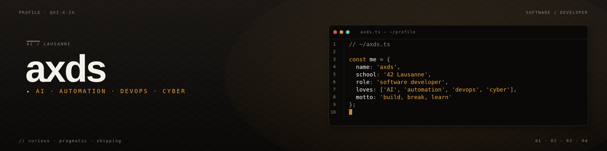

 

Étudiante à **[42 Lausanne](https://42lausanne.ch/)**, je construis mon expertise autour du **développement système**, de l'**algorithmie** et de la **programmation bas niveau** en **C / C++**.  
En parallèle, je travaille sur des projets **backend**, **DevOps**, **cybersécurité**, **intelligence artificielle** et **optimisation logicielle**.

💡 Ce qui me motive : comprendre comment les systèmes fonctionnent *réellement* — de la gestion mémoire manuelle aux pipelines CI/CD multi-étages.

🔗 Site personnel & portfolio : **[axds.ch](https://axds.ch)**

<!--

-->

  

---

## 🎯 En recherche active de stage

**Développeur Junior / Backend / DevOps / SRE / IA**   
📅 Disponible immédiatement  
📍 Suisse · Europe · Remote  

  

---

## 🚀 Projets

### 🛡️ Cybersécurité

| Projet | Description | Stack |
|--------|-------------|-------|
| **[Sec_audit](https://github.com/XI-X-IX/Sec_audit)** | Auditeur SaaS automatisé — headers HTTP, SSL/TLS, scan de ports, endpoints sensibles, cookies. Rapport JSON + PDF avec score /100 | `Python` · `reportlab` |
| **[network_scan](https://github.com/XI-X-IX/network_scan)** | Scanner réseau en ligne de commande — détection d'hôtes, ports et protocoles | `Python` · `Sockets` · `Threads` |

### ⚙️ DevOps & Infrastructure

| Projet | Description | Stack |
|--------|-------------|-------|
| **[Inception](https://github.com/XI-X-IX/Inception)** | Infrastructure Docker complète — NGINX, WordPress, MariaDB, Redis, Prometheus/Grafana, FTP | `Docker` · `Compose` · `Bash` |
| **[DevOps](https://github.com/XI-X-IX/DevOps)** | Pipeline DevSecOps bout-en-bout — SAST (Bandit), scans dépendances (Safety), secrets (TruffleHog), Trivy, Terraform, K8s | `Python` · `Flask` · `GitHub Actions` · `Terraform` · `Kubernetes` |

### 🤖 Intelligence artificielle

| Projet | Description | Stack |
|--------|-------------|-------|
| **[LinearRegression](https://github.com/XI-X-IX/LinearRegression)** | Régression linéaire *from scratch* avec descente de gradient — métriques MAE / RMSE / R² et monitoring | `Python` · `matplotlib` |
| **[CrewAI Agents](https://github.com/XI-X-IX/CrewAI)** | 3 équipes d'agents IA *100 % locales* (Ollama) : création de contenu, assistant e-commerce, détection de produits winners | `Python` · `CrewAI` · `Ollama` |

### 🖥️ Systèmes bas niveau (42)

| Projet | Description | Stack |
|--------|-------------|-------|
| **[push_swap](https://github.com/XI-X-IX/push_swap)** | Tri d'une pile avec parsing, gestion mémoire manuelle et algorithme optimisé | `C` |
| **[so_long](https://github.com/XI-X-IX/so_long)** | Mini-jeu 2D créé *from scratch* avec la MiniLibX | `C` · `mlx` |
| **[python_piscine](https://github.com/XI-X-IX/python_piscine)** | Piscine Python 42 — de la syntaxe aux objets, en passant par les exceptions | `Python` |

### 🌐 Web & automatisation

| Projet | Description | Stack |
|--------|-------------|-------|
| **[axds.ch](https://axds.ch)** | Portfolio personnel — design moderne, animations fluides ([repo](https://github.com/XI-X-IX/http)) | `Next.js` · `TypeScript` · `Tailwind` |
| **[DemoXbot](https://github.com/XI-X-IX/DemoXbot)** | Bot de trading crypto automatisé | `Python` |
| **[Trading / AlgoTraderX](https://github.com/XI-X-IX/Trading)** | Suite de bots de trading — RSI, MACD, Bollinger Bands et détection de nouveaux listings Binance | `Python` · `python-binance` |
| **[intern-bot](https://github.com/XI-X-IX/intern-bot)** | Bot Telegram de veille d'offres d'emploi Suisse Romande (scraping + filtrage par mots-clés) | `Python` · `BeautifulSoup` |

  

---

## 🛠️ Stack technique

 

 

---

## 🎓 42 Lausanne — Progression

 

### 🔐 Spécialisations en cours — **IA, Data & Cybersécurité**

Le Common Core est terminé, et je suis déjà en spécialisations **IA/Data** et **cybersécurité**.  
Focus actuel : **machine learning**, **data engineering**, **sécurité applicative** et **automatisation d'outils**.

 

 

███████████░░░░░░░░░░  **11 / 21**

  

---

*Made with ❤️ from 42 Lausanne*
 
*Exploring systems, networks and cybersecurity — one project at a time.*

